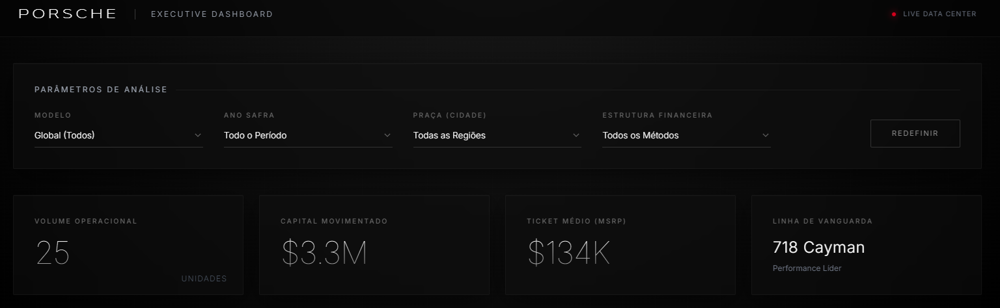
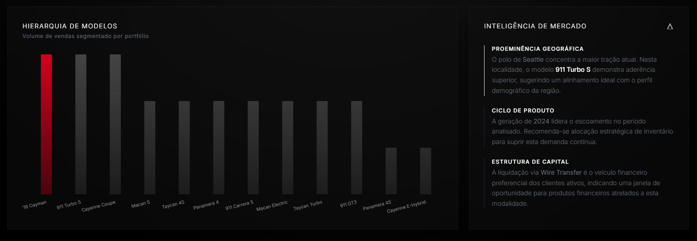
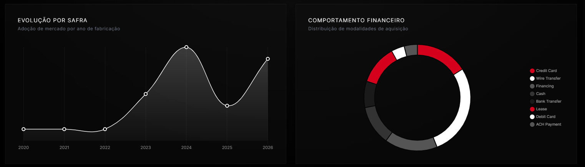

# Porsche Executive Dashboard

## 🚘 Criando uma Dashboard da Porsche com Agentes de IA

Dashboard executivo desenvolvido como projeto do curso da **DIO**, com
apoio de **Agentes de Inteligência Artificial**, utilizando análise de
dados, indicadores de desempenho, visualizações gráficas e geração de
insights estratégicos.

## 📊 Sobre o projeto

O projeto transforma uma base de dados de veículos Porsche em uma
dashboard executiva interativa, permitindo analisar informações de
vendas, modelos, valores, localização e modalidades de pagamento.

A solução foi estruturada para facilitar a interpretação dos dados e
apoiar uma visão gerencial do negócio por meio de **KPIs, filtros,
gráficos e insights automatizados**.

## 🎯 Objetivo

Criar uma solução visual e analítica capaz de transformar dados brutos
em informações úteis para análise de mercado e tomada de decisão.

## 🚀 Principais funcionalidades

-   Filtros interativos por modelo;
-   Filtro por ano de fabricação;
-   Filtro por praça/cidade;
-   Filtro por estrutura/modalidade financeira;
-   Indicador de volume operacional;
-   Indicador de capital movimentado;
-   Cálculo do ticket médio (MSRP);
-   Identificação do modelo de maior destaque;
-   Evolução por safra;
-   Distribuição das modalidades de aquisição;
-   Hierarquia de modelos por volume;
-   Análise de inteligência de mercado;
-   Geração de insights estratégicos;
-   Atualização dinâmica dos indicadores e gráficos conforme os filtros.

## 📈 Indicadores analisados

A dashboard apresenta indicadores executivos relacionados a:

-   Volume de veículos;
-   Capital movimentado;
-   Ticket médio;
-   Modelos com maior volume;
-   Evolução das vendas por ano;
-   Distribuição das modalidades de pagamento;
-   Distribuição geográfica;
-   Comportamento do portfólio.

## 🤖 Uso de Inteligência Artificial

A Inteligência Artificial foi utilizada como apoio durante o
desenvolvimento do projeto, contribuindo para:

-   Estruturação da solução;
-   Definição da arquitetura da dashboard;
-   Organização e interpretação dos dados;
-   Desenvolvimento das funcionalidades;
-   Construção dos componentes visuais;
-   Geração e aprimoramento dos insights analíticos;
-   Identificação de possibilidades de melhoria na apresentação dos
    dados.

O projeto demonstra, na prática, como agentes e ferramentas de IA podem
auxiliar na construção de soluções de análise de dados e Business
Intelligence.

## 🖼️ Demonstração

### Funcionalidades



### Gráficos e insights



### Evolução dos dados



## 🗂️ Estrutura do projeto

``` text
dashboard_porsche/
│
├── images/
│   ├── funcionalidades.png
│   ├── grafico_insight.png
│   └── grafico_evolução.png
│
├── Porsche_Dashboard_Projeto.xlsx
├── index.html
└── README.md
```

> Os nomes dos arquivos podem variar conforme a versão final
> disponibilizada no repositório.

## 🛠️ Tecnologias utilizadas

-   HTML5
-   CSS
-   JavaScript
-   Tailwind CSS
-   Chart.js
-   Excel
-   Inteligência Artificial / Agentes de IA

## 📁 Base de dados

A base utilizada no projeto contém informações relacionadas aos veículos
Porsche, incluindo dados como:

-   Modelo;
-   Ano;
-   Valor;
-   Quilometragem;
-   Modalidade de pagamento;
-   Cidade;
-   Estado;
-   Vendedor;
-   Status de entrega.

Os dados são utilizados para alimentar os filtros, indicadores, gráficos
e análises apresentadas na dashboard.

## 💡 Principais insights

A dashboard foi desenvolvida para permitir a identificação de padrões e
oportunidades, como:

-   Modelos com maior volume de vendas;
-   Evolução da procura ao longo dos anos;
-   Regiões com maior concentração de operações;
-   Modalidades financeiras mais utilizadas;
-   Comportamento do portfólio de veículos;
-   Destaques de mercado e oportunidades estratégicas.

## 🎨 Identidade visual

A interface foi desenvolvida com uma proposta visual inspirada no
posicionamento premium da Porsche, utilizando:

-   Fundo escuro;
-   Tipografia minimalista;
-   Destaques em vermelho;
-   Cards executivos;
-   Gráficos de alto contraste;
-   Organização voltada para análise gerencial.

## 📌 Observação

Este projeto possui finalidade **educacional e acadêmica**, desenvolvido
como parte de uma atividade de formação em tecnologia e Inteligência
Artificial.

Os dados e análises apresentados têm finalidade demonstrativa e não
representam dados oficiais da Porsche.

## 👨‍💻 Projeto acadêmico

**Projeto:** Criando uma Dashboard da Porsche com Agentes de IA\
**Repositório:** `dashboard_porsche`\
**Curso:** DIO

------------------------------------------------------------------------

⭐ Projeto desenvolvido para demonstrar a aplicação prática de **dados +
dashboards + Inteligência Artificial** na construção de uma solução
analítica.
